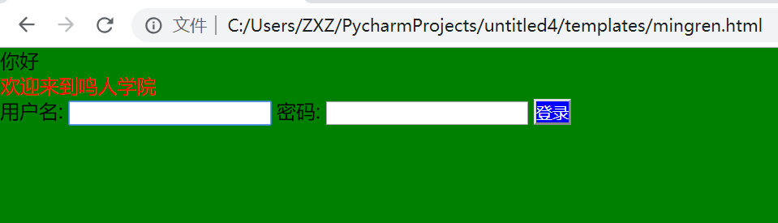
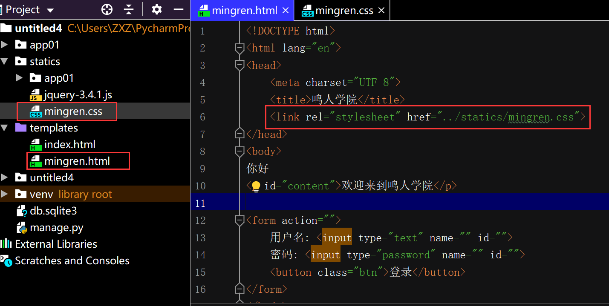

[TOC]

## <font color="#0099CC">概念</font>

理解：装饰

样式：颜色、字体、距离、定位...

## <font color="#0099CC">语法</font>

```html
<!DOCTYPE html>
<html lang="en">
    <head>
        <style>
            选择器 {css属性:样式;}
        </style>
    </head>

    <body>
    </body>
</html>
```

## <font color="#0099CC">示例一</font>

```html
<!DOCTYPE html>
<html lang="en">
<head>
    <meta charset="UTF-8">
    <title>鸣人学院</title>

    <style>
        p{
            color: red;
        }
    </style>
</head>
<body>
你好
<p id="content">欢迎来到</p>
</body>
</html>
```


## <font color="#0099CC">示例二</font>

```html
<!DOCTYPE html>
<html lang="en">
<head>
    <meta charset="UTF-8">
    <title>鸣人学院</title>

    <style>
        p{
            color: red;
        }

        body{
            background-color: green;
        }
    </style>
</head>
<body>
你好
<p id="content">欢迎来到</p>
</body>
</html>
```


## <font color="#0099CC">示例三</font>

```html
<!DOCTYPE html>
<html lang="en">
<head>
    <meta charset="UTF-8">
    <title>鸣人学院</title>

    <style>
        *{
            padding: 0;
            margin: auto;
        }

        p{
            color: red;
        }

        body{
            background-color: green;
        }
        .btn{
            background-color: blue;
            color: white;
        }
    </style>
</head>
<body>
你好
<p id="content">欢迎来到鸣人学院</p>

<form action="">
    用户名: <input type="text" name="" id="">
    密码: <input type="password" name="" id="">
    <button class="btn">登录</button>
</form>
</body>
</html>
```



## <font color="#0099CC">语法二</font>

css代码放到另一个文件

