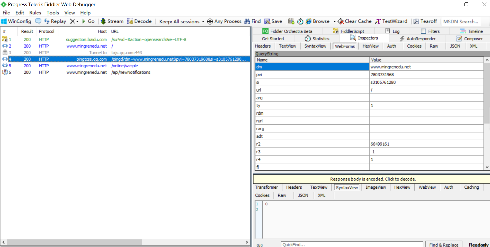

[TOC]

## <font color="#0099CC">抓包工具</font>

访问http://www.mingrenedu.net/

- 浏览器控制台(谷歌浏览器：右键 -> 检查 / F12
  

- Fiddler

  

## <font color="#0099CC">HTTP库</font>

- Python库

  ```
  requests  # 同步库+并发(gevent/async) = 高性能
  aiohttp  # 高性能
  ```

- curl(Linux平台)

