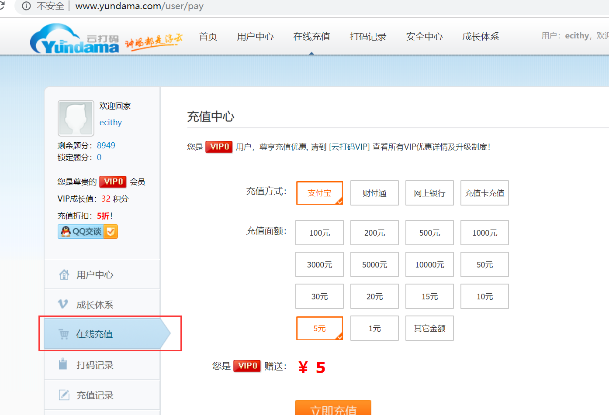
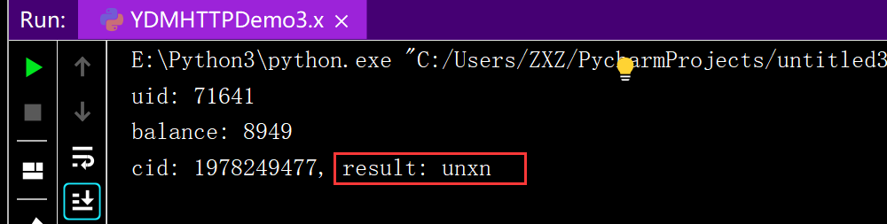

[TOC]

## <font color="#0099CC">为什么设计验证码</font>

为了区别机器还是人，防止代码自动登录

## <font color="#0099CC">如何绕过验证码</font>

爬虫工程师的目的不是破解验证码，而是不触发验证码

## <font color="#0099CC">破解步骤</font>

下载图片到本地然后识别

## <font color="#0099CC">识别方式</font>
### <font color="#F77A0B">按人工和自动</font>

- 人工(不推荐)

  定义：验证码识别时中断程序，等待人输入验证码

  优点：免费

  缺点：依赖人

- 自动：

  定义：程序识别
  
  优点：不依赖人
  
  缺点：识别准确率不是100%(但是也很高接近100%)

### <font color="#F77A0B">按本地和在线</font>

- 本地

  定义：使用第三方验证码识别库

  优点：免费

  缺点：使用复杂

- 在线识别(推荐)

	定义：使用第三方网站的接口
	
	优点：识别简单，准确率高
	
	缺点：付费（费用较低，几分钱一次）
	
	云打码[http://www.yundama.com](http://www.yundama.com/)
	
## <font color="#0099CC">云打码使用流程</font>

### <font color="#F77A0B">用户注册</font>

http://www.yundama.com/index/reg

需要注册两个用户：一个用户 一个开发者


### <font color="#F77A0B">用户登录</font>


### <font color="#F77A0B">充值</font>



### <font color="#F77A0B">开发者登录</font>


### <font color="#F77A0B">创建软件</font>


### <font color="#F77A0B">下载示例代码</font>


### <font color="#F77A0B">识别验证码</font>


- 需要填写参数

  YDMHTTPDemo3.x.py

  

```python
# 用户名
username = ''  # 此账号是用户账号不是开发者账号

# 密码
password = ''

# 软件ＩＤ，开发者分成必要参数。登录开发者后台【我的软件】获得！
appid = 1

# 软件密钥，开发者分成必要参数。登录开发者后台【我的软件】获得！
appkey = ''

# 图片文件
filename = 'getimage.jpg'

# 验证码类型，# 例：1004表示4位字母数字，不同类型收费不同。请准确填写，否则影响识别率。在此查询所有类型 http://www.yundama.com/price.html
codetype = 1004
```

准备好验证码图片


运行程序

