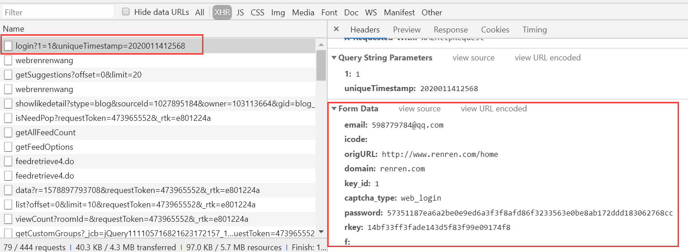

[TOC]

## <font color="#0099CC">登录人人网</font>

### <font color="#F77A0B">登录流程</font>




### <font color="#F77A0B">编码</font>

```python
#!/usr/bin/env python
# -*- coding:utf-8 -*-
import requests, json

session = requests.session()
session.keep_alive = False


def login():
    '''
    登录
    '''
    # 登录请求的url（通过抓包工具获取）
    post_url = 'http://www.renren.com/ajaxLogin/login?1=1&uniqueTimestamp=2020011520227'
    # 伪装UA
    headers = {
        'User-Agent': 'Mozilla/5.0 (Windows NT 10.0; Win64; x64) AppleWebKit/537.36 (KHTML, like Gecko) Chrome/73.0.3683.75 Safari/537.36',
    }
    # 参数处理
    data = {
        'email': '598779784@qq.com',
        'origURL': 'http://www.renren.com/home',
        'domain': 'renren.com',
        'key_id': '1',
        'captcha_type': 'web_login',
        'password': '9a5d7d83315531ac13cb89c1210ee200b34c614055e3c13af10fdeaab9733df3',
        'rkey': '04bc54f29e155664686789830bd85924',
        'f': 'http%3A%2F%2Fwww.renren.com%2F580329321%2Fnewsfeed%2Fphoto',
    }
    # 模拟登录请求发送
    session.post(url=post_url, data=data, headers=headers)
    print('登录成功')
    
def get_profile():
    '''
    个人中心页面
    '''
    url_profile = 'http://www.renren.com/580329321/profile'
    response = session.get(url_profile)
    # 设置响应内容的编码格式
    response.encoding = 'utf-8'
    # 将响应内容写入文件
    with open('./renren.html', 'w', encoding='utf-8') as f:
        f.write(response.text)

if __name__ == "__main__":
    login()
    get_profile()
```


