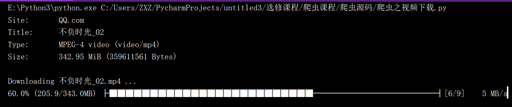

[TOC]

## <font color="#0099CC">you-get</font>

> 图片：不需要open()的复杂操作
>
> 视频：you-get会自动分析网页中的视频URL

官网 https://github.com/soimort/you-get/

### <font color="#F77A0B">下载视频</font>

```python
'''
下载视频(图片同理)
'''
import sys, you_get

def download(url, path):
    sys.argv = ['you-get', '-o', path, url]
    you_get.main()

if __name__ == '__main__':
    # 视频网站的地址
    url = 'https://v.qq.com/x/cover/mzc00200p01q3zs/w00328ox644.html'
    # 视频输出的位置
    path = 'G:/test'
    download(url, path)
```



### <font color="#F77A0B">下载音频</font>

```python
'''
下载音频
'''
import sys, you_get


def download(url, path):
    sys.argv = ['you-get', '-o', path, url]
    you_get.main()


if __name__ == '__main__':
    # 音频网站的地址
    url = 'https://www.kugou.com/song/#hash=8E496D133287434A933DCB63A5DE8982&album_id=973001'
    # 音频输出的位置
    path = 'G:/test'
    download(url, path)

```

