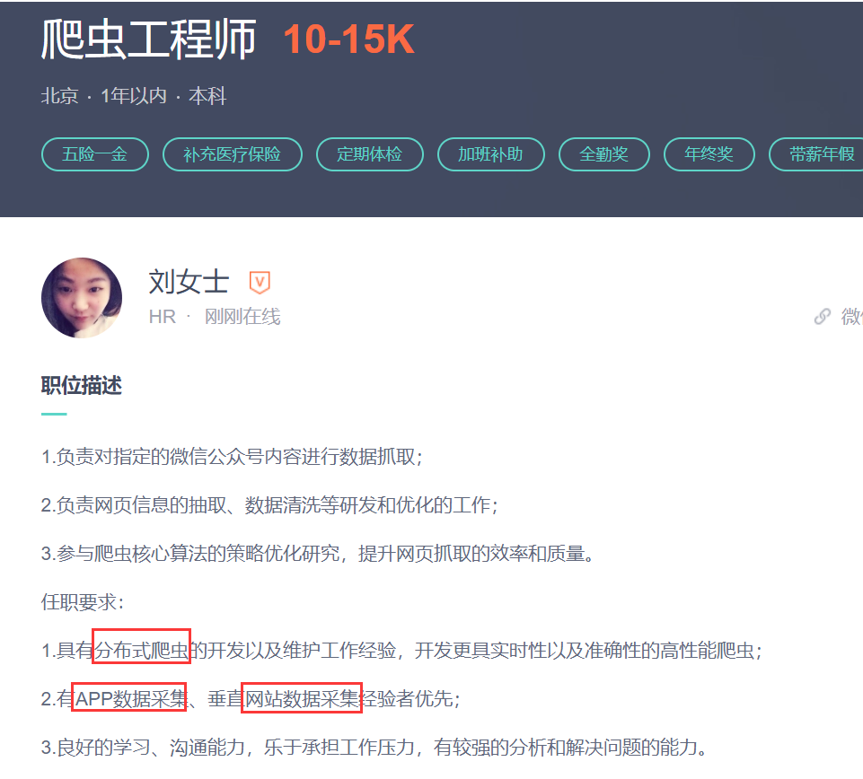
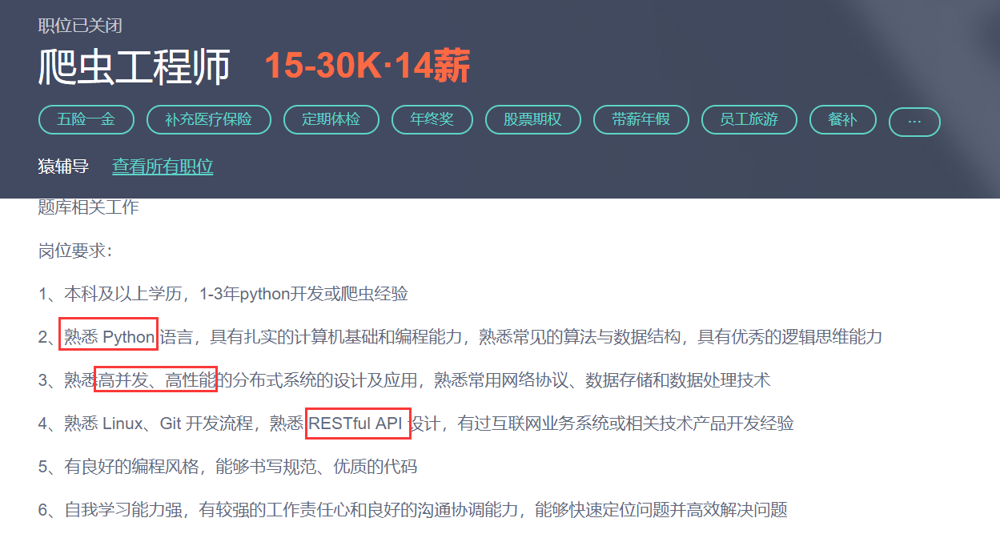
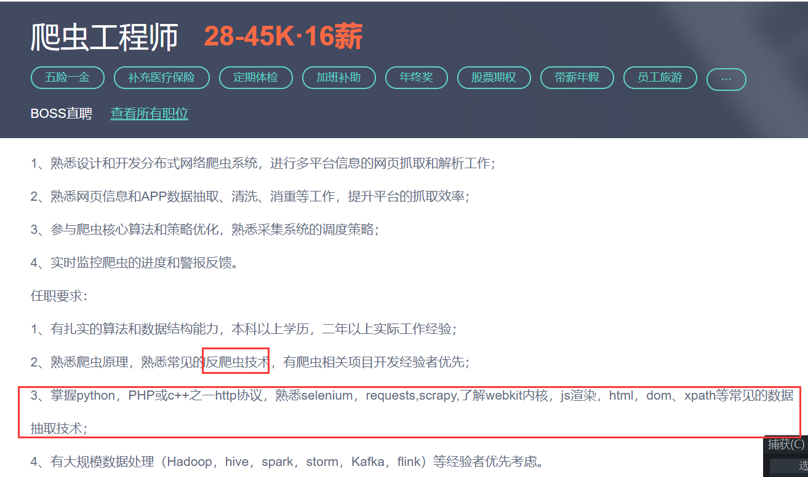

## 为什么会有爬虫工程师这个职位

1.有些公司的业务就是需要整合其它网站/APP的数据（如今日头条）

2.新上线的产品需要有初始数据

3.某些业务需要数据制定策略（数据分析）

4.黑产（挂号、水贴、抢票等）

随着大数据时代的来临，爬虫工程师会更加被需要

## 爬虫的合法性

爬虫干扰了被访问网站/APP的正常运行、运营

爬虫抓取了受到法律保护的数据

## 爬虫的要求和待遇

