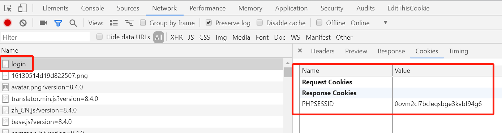

## <font color="#0099CC">概念</font>

Cookie是一种数据，数据存储在服务端和；客户端(如浏览器)，因此客户端不安全。

Session是基于Cookie的一种更安全的方式，数据存储在服务端。

Cookie/Session常用于存储账号信息

```
登录流程：

1.输入账号密码

2.服务器接收到账号密码校验成功

3.服务器发送cookie数据给浏览器

4.浏览器以后会自动带着cookie发送给服务器
```

登陆前的cookie



登陆后的cookie


