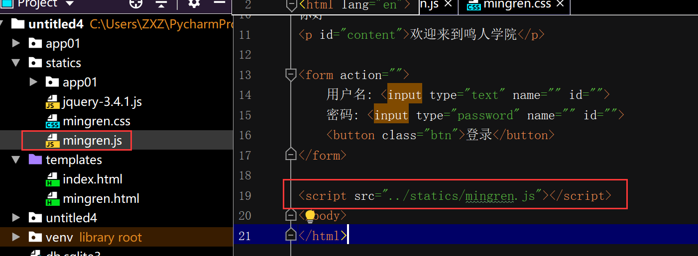

[TOC]

## <font color="#0099CC">概念</font>

理解：搭配

操作html和css

和Python类似

```
变量
数据类型
流程控制
函数
异常
并发(ajax)
...
```

## <font color="#0099CC">语法</font>

一般JS代码放在最后（因为JS操作html和css，等html和css加载完(从上至下)）

```html
<!DOCTYPE html>
<html lang="en">
    <head>
    </head>

    <body>
        <script>
        </script>
    </body>
</html>
```

## <font color="#0099CC">调试工具</font>

浏览器 开发工具


## <font color="#0099CC">示例</font>

```html
<!DOCTYPE html>
<html lang="en">
<head>
    <meta charset="UTF-8">
    <title>鸣人学院</title>

    <style>
        *{
            padding: 0;
            margin: auto;
        }

        p{
            color: red;
        }

        body{
            background-color: green;
        }
        .btn{
            background-color: blue;
            color: white;
        }
    </style>
</head>
<body>
你好
<p id="content">欢迎来到鸣人学院</p>

<form action="">
    用户名: <input type="text" name="" id="">
    密码: <input type="password" name="" id="">
    <button class="btn">登录</button>
</form>

<script>
    alert("hello world");
    var x = 1;
    var y =2;
    console.log(x+y);

    if (x+y===2){
        x = document.getElementById("content");
        x.innerHTML="欢迎来到我家"
    }

</script>
</body>
</html>
```

## <font color="#0099CC">语法二</font>

```html
<!DOCTYPE html>
<html lang="en">
<head>
    <meta charset="UTF-8">
    <title>鸣人学院</title>

    <link rel="stylesheet" href="../statics/mingren.css">
</head>
<body>
你好
<p id="content">欢迎来到鸣人学院</p>

<form action="">
    用户名: <input type="text" name="" id="">
    密码: <input type="password" name="" id="">
    <button class="btn">登录</button>
</form>

<script src="../statics/mingren.js"></script>
</body>
</html>
```


