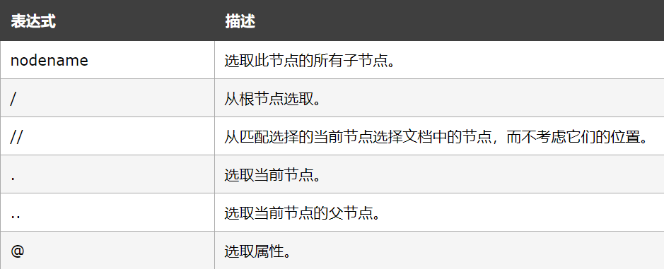
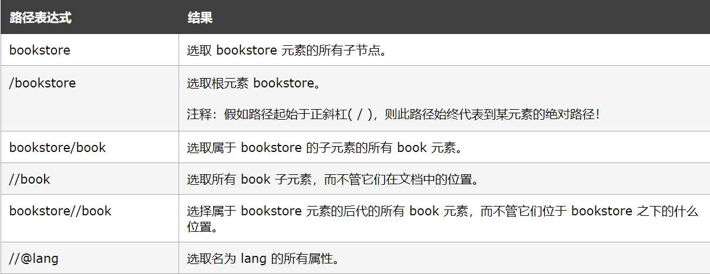

[TOC]
## <font color="#0099CC">lxml库介绍</font>

xpath解析是我们在爬虫中最常用也是最通用的一种数据解析方式，Python中的lxml库支持这种解析方式

## <font color="#0099CC">文档</font>

https://www.w3school.com.cn/xpath/index.asp

## <font color="#0099CC">xpath解析原理</font>

```python
1.使用通用爬虫爬取网页数据

2.实例化etree对象，且将页面数据加载到该对象中

3.使用xpath表达式进行标签定位和指定数据提取
```

## <font color="#0099CC">选取节点</font>

### <font color="#F77A0B">路径表达式</font>



### <font color="#F77A0B">实例</font>



### <font color="#F77A0B">常用xpath表达式</font>

```python
属性定位：
    #找到class属性值为sing的div标签
    //div[@class="sing"]
层级&索引定位：
    #找到class属性值为dance的div的直系子标签ul下的第二个子标签li下的直系子标签a
    //div[@class="dance"]/ul/li[2]/a
逻辑运算：
    #找到href属性值为空且class属性值为xxx的a标签
    //a[@href="" and @class="xxx"]
模糊匹配：
    //div[contains(@class, "xxx")]
    //div[starts-with(@class, "xxx")]
取文本：
    # /表示获取某个标签下的文本内容
    # //表示获取某个标签下的文本内容和所有子标签下的文本内容
    //div[@class="sing"]/p[1]/text()
    //div[@class="dance"]//text()
取属性：
    //div[@class="dance"]//li[2]/a/@href
```

## <font color="#0099CC">xpath插件</font>

- ctrl+shift+x 调出插件
- 该插件主要能帮助你在各类网站上通过按shift键选择想要查看的页面元素来提取查询其代码


简化语法


## <font color="#0099CC">etree对象实例化</font>

```python
- 本地文件：tree = etree.parse(文件名)
                tree.xpath("xpath表达式")
- 网络数据：tree = etree.HTML(网页内容字符串)
                tree.xpath("xpath表达式")
```


