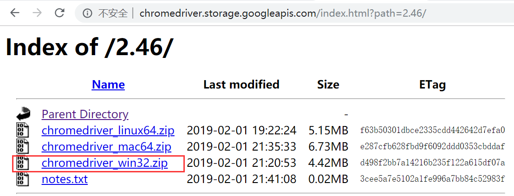
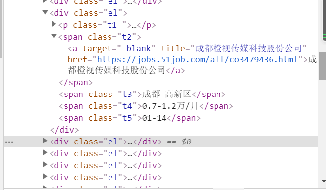

[TOC]

## <font color="#0099CC">selenium是什么</font>

作用：自动操作浏览器

历史：本来是测试人员，用来自动操控浏览器用的

## <font color="#0099CC">selenium在爬虫中的使用场景</font>

- 登录
- JS动态加载

## <font color="#0099CC">selenium使用流程</font>

### <font color="#F77A0B">安装selenium模块</font>

```python
pip install selenium
```

### <font color="#F77A0B">下载谷歌浏览器</font>

推荐使用版本: 73

https://www.chromedownloads.net/

### <font color="#F77A0B">下载浏览器驱动</font>

http://chromedriver.storage.googleapis.com/index.html

注意：

selenium之 chromedriver与chrome版本要对应，版本映射表

https://blog.csdn.net/zbj18314469395/article/details/100560044

查看浏览器版本（谷歌）：chrome://settings/help




## <font color="#0099CC">页面源码之前程无忧招聘</font>

```python
'''
前程无忧招聘
'''
from selenium import webdriver
from lxml import etree
from time import sleep

# 实例化一个浏览器对象
browser = webdriver.Chrome(executable_path='./chromedriver')
# 让浏览器发起一个指定url对应请求
browser.get(
    'https://search.51job.com/list/000000,000000,0000,00,9,99,%25E7%2588%25AC%25E8%2599%25AB,2,1.html?lang=c&stype=&postchannel=0000&workyear=99&cotype=99&degreefrom=99&jobterm=99&companysize=99&providesalary=99&lonlat=0%2C0&radius=-1&ord_field=0&confirmdate=9&fromType=&dibiaoid=0&address=&line=&specialarea=00&from=&welfare=')

'''方法一
print(browser.find_element_by_xpath("//div[@class='el']"))
'''

'''方法二
'''
# page_source获取浏览器当前页面的页面源码数据
page_text = browser.page_source

# 解析岗位信息
tree = etree.HTML(page_text)
work_list = tree.xpath("//div[@id='resultList']//div[@class='el']")
print(work_list)
for li in work_list:
    work_name = li.xpath("./p/span/a/@title")[0]  # xpath函数返回的为列表

    name = li.xpath("./span")
    company = name[0].xpath("./a")[0].text
    address = name[1].text
    salary = name[2].text
    publish_date = name[3].text

    print(work_name, company, address, salary, publish_date)
    
sleep(2)
browser.quit()
```





## <font color="#0099CC">frame切换之登录QQ空间</font>

> frameset不用切，frame/iframe需要层层切
>如果元素在frame/iframe中，需要切入才能定位到

语法

```
switch_to.frame()  切到frame中

switch_to.default_content()  从frame中切回主文档 切到frame中之后，我们便不能继续操作主文档的元素，这时如果想操作主文档内容，则需切回主文档

switch_to.parent_frame()  切回父级frame
```


```python
'''
登录QQ空间
'''
from selenium import webdriver
from time import sleep

bro = webdriver.Chrome(executable_path='./chromedriver')

bro.get('https://qzone.qq.com/')
sleep(1)
bro.switch_to.frame('login_frame')

a_tag = bro.find_element_by_id("switcher_plogin")
a_tag.click()

userName_tag = bro.find_element_by_id('u')
password_tag = bro.find_element_by_id('p')
sleep(1)
userName_tag.send_keys('598779784')
sleep(1)
password_tag.send_keys('liu1314.@qq')
sleep(1)
btn = bro.find_element_by_id('login_button')
btn.click()

sleep(3)

bro.quit()
```

## <font color="#0099CC">规避检测之智联招聘</font>

> 规避检测:  window.navigator.webdriver=undefined

```python
'''
智联招聘
'''
from selenium import webdriver
from time import sleep
# 实现无可视化界面
# from selenium.webdriver.chrome.options import Options
# 实现规避检测
from selenium.webdriver import ChromeOptions

# 实现无可视化界面的操作
# chrome_options = Options()
# chrome_options.add_argument('--headless')
# chrome_options.add_argument('--disable-gpu')

# 实现规避检测
option = ChromeOptions()
option.add_experimental_option('excludeSwitches', ['enable-automation'])

# 如何实现让selenium规避被检测到的风险
bro = webdriver.Chrome(executable_path='./chromedriver', options=option)

# 无可视化界面
bro.get('https://sou.zhaopin.com/?jl=530&kw=python&kt=3')
sleep(2)
print(bro.page_source)
sleep(30)
bro.quit()
```

## <font color="#0099CC">selenium高级语法</font>

### <font color="#F77A0B">动作链</font>

```python
from selenium import webdriver
from time import sleep
#导入动作链对应的类
from selenium.webdriver import ActionChains
bro = webdriver.Chrome(executable_path='./chromedriver')

bro.get('https://www.runoob.com/try/try.php?filename=jqueryui-api-droppable')

#如果定位的标签是存在于iframe标签之中的则必须通过如下操作在进行标签定位
bro.switch_to.frame('iframeResult')#切换浏览器标签定位的作用域
div = bro.find_element_by_id('draggable')

#动作链
action = ActionChains(bro)
#点击长按指定的标签
action.click_and_hold(div)

for i in range(5):
    #perform()立即执行动作链操作
    #move_by_offset(x,y):x水平方向 y竖直方向
    action.move_by_offset(17,0).perform()
    sleep(0.5)

#释放动作链
action.release()

bro.quit()
```

### <font color="#F77A0B">其它</font>

```python
from selenium import webdriver
from time import sleep
bro = webdriver.Chrome(executable_path='./chromedriver')

bro.get('https://www.taobao.com/')

#标签定位
search_input = bro.find_element_by_id('q')
#标签交互
search_input.send_keys('Iphone')


#执行一组js程序
bro.execute_script('window.scrollTo(0,document.body.scrollHeight)')
sleep(2)
#点击搜索按钮
btn = bro.find_element_by_css_selector('.btn-search')
btn.click()


bro.get('https://www.baidu.com')
sleep(2)
#回退
bro.back()
sleep(2)
#前进
bro.forward()


sleep(5)

bro.quit()
```

